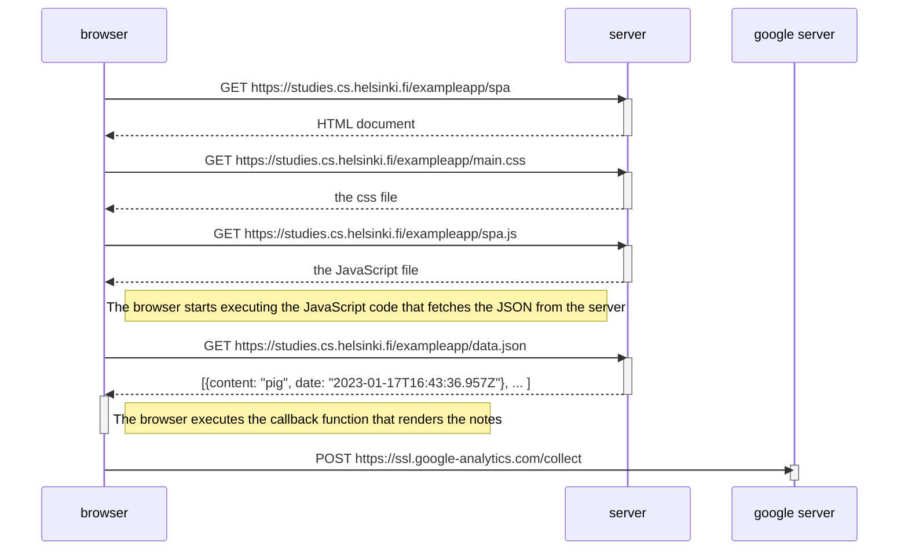

```mermaid
sequenceDiagram
    participant browser
    participant server
    participant google server
    
    browser->>server: GET https://studies.cs.helsinki.fi/exampleapp/spa
    activate server
    server-->>browser: HTML document
    deactivate server
    
    browser->>server: GET https://studies.cs.helsinki.fi/exampleapp/main.css
    activate server
    server-->>browser: the css file
    deactivate server
    
    browser->>server: GET https://studies.cs.helsinki.fi/exampleapp/spa.js
    activate server
    server-->>browser: the JavaScript file
    deactivate server
    
    Note right of browser: The browser starts executing the JavaScript code that fetches the JSON from the server
    
    browser->>server: GET https://studies.cs.helsinki.fi/exampleapp/data.json
    activate server
    server-->>browser: [{content: "pig", date: "2023-01-17T16:43:36.957Z"}, ... ]
    deactivate server    
    
    activate browser
    Note right of browser: The browser executes the callback function that renders the notes
    deactivate browser    
    
    browser->>google server: POST https://ssl.google-analytics.com/collect
    activate google server
    deactivate google server
    
```
