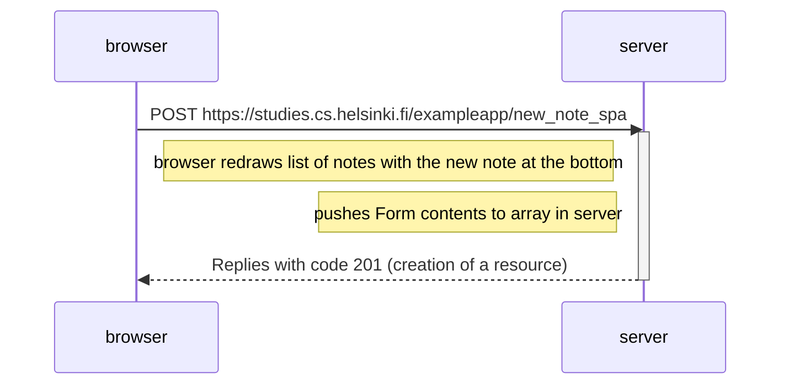

```mermaid
sequenceDiagram
    participant browser
    participant server
    
    browser->>server: POST https://studies.cs.helsinki.fi/exampleapp/new_note_spa
    activate server
    Note right of browser: browser redraws list of notes with the new note at the bottom
    Note left of server: pushes Form contents to array in server
    server-->>browser: Replies with code 201 (creation of a resource)
    deactivate server
    
    
```
